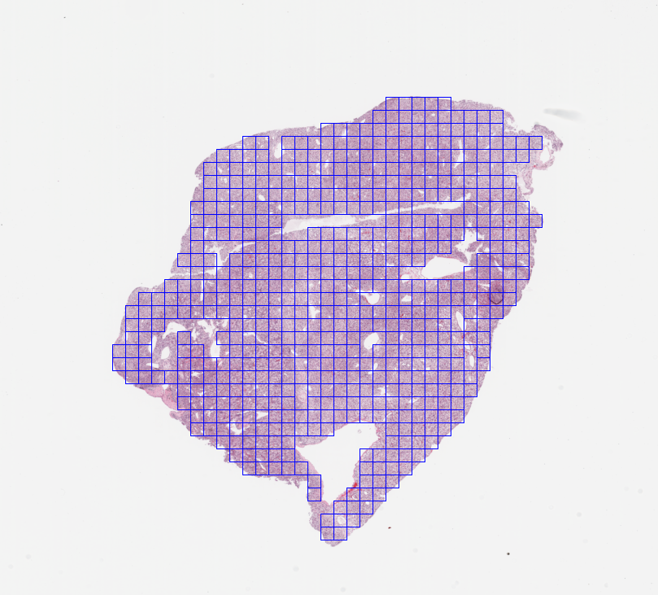

# WSI-Tiler

Very simple, parallel Whole-Slide-Imaging Tiler for Digital Histopathology built using histolab and ray.

## Install

```
conda create -n wsi_env python=3.8
conda activate wsi
pip install -r requirements.txt
```

## Usage

```
python wsi_tiler.py -h
```

```
usage: wsi_tiler.py [-h] [--tile_size TILE_SIZE] [--tissue_percent TISSUE_PERCENT] wsi_dir out_dir

Split Whole-Slide-Images into a set of smaller tiles.

positional arguments:
  wsi_dir               (Possibly nested) directory containing input WSIs.
  out_dir               Directory for tiles, reports, thumbnails, ray logs.

optional arguments:
  -h, --help            show this help message and exit
  --tile_size TILE_SIZE
                        Specifies height and width of the resulting square tiles.
  --tissue_percent TISSUE_PERCENT
                        Reject tiles containing less then `tissue_percent` tissue.
```

## Outputs

The tiler creates three separate directories `tiles`, `score_reports`, `tiler_thumbnails` in the user-specified `out_dir` directory.

The `tiles` directory contains all generated tiles from all WSIs found in `wsi_dir`. Tiles are saved with the pattern `{slide.name}_tile_{tiles_counter}_level{level}_{x_ul_wsi}-{y_ul_wsi}-{x_br_wsi}-{y_br_wsi}.png` where `x_ul_wsi, y_ul_wsi, x_br_wsi, y_br_wsi` describe the top-left and bottom-right pixel coordinates of the tile in the WSI.

The `score_reports` directory contains one .csv file for each WSI. For a given WSI, the table contains URIs to the resulting tiles associated with a combined Nuclei-Tissue-Detection score. This score can be useful for sampling images during training.

| Index | filename | score | scaled_score |
| ---| --- | --- | --- |
|  0 | C3L-00004-21_tile_0_level0_5450-14577-5962-15089.png   | 0.156751 |       1        |
|  1 | C3L-00004-21_tile_1_level0_6986-13041-7498-13553.png   | 0.154509 |       0.982271 |
|  2 | C3L-00004-21_tile_2_level0_7498-12017-8010-12529.png   | 0.154412 |       0.9815   |
|  3 | C3L-00004-21_tile_3_level0_18762-10481-19274-10993.png | 0.153387 |       0.973393 |
| ... | ... | ... | ... |

The `tiler_thumbnails` directory contains a thumbnail for each WSI with extracted tiles as bounding boxes:



`slide_status.csv` is saved in the `out_dir` directory and indicates whether the tiling succeeded or failed for a given WSI. This can be handy when working with a large set of images.

Finally, all ray logs are saved by default in the temporary directory `/tmp/wsi_tiler_ray_logs`.

## References

- https://github.com/histolab/histolab
